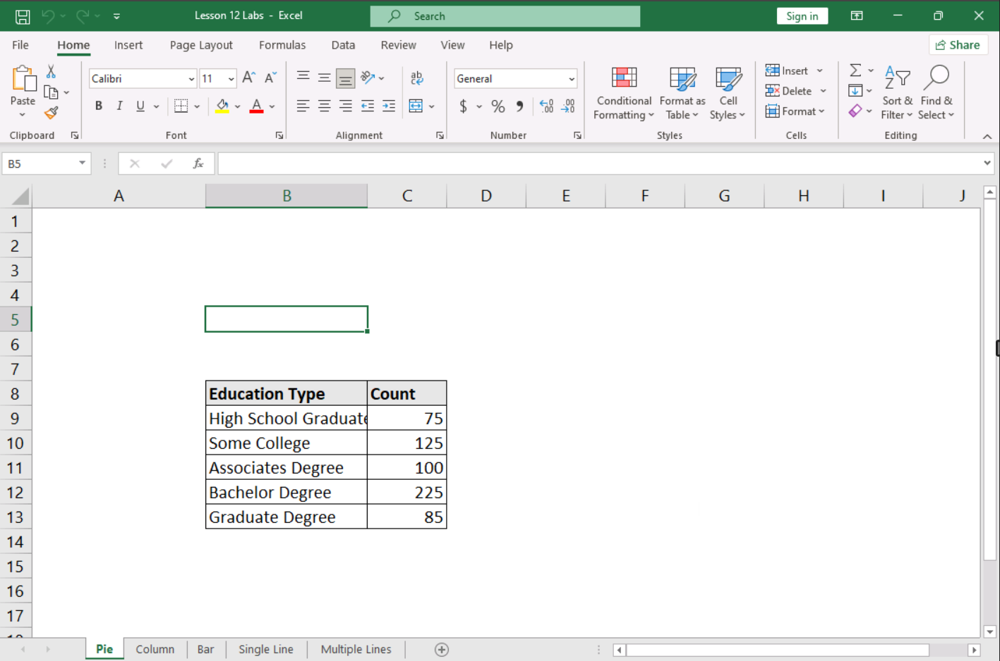
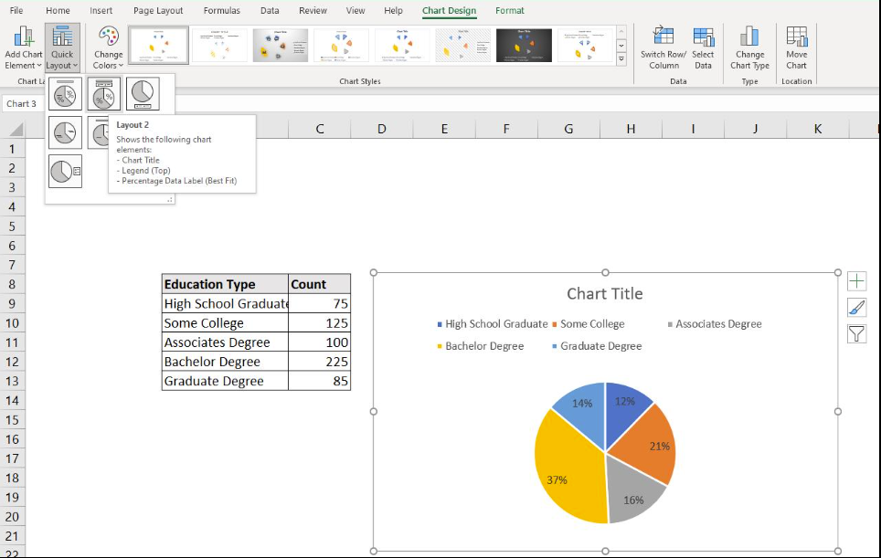
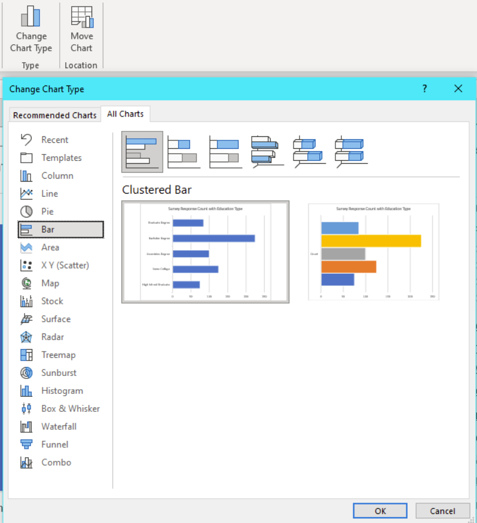
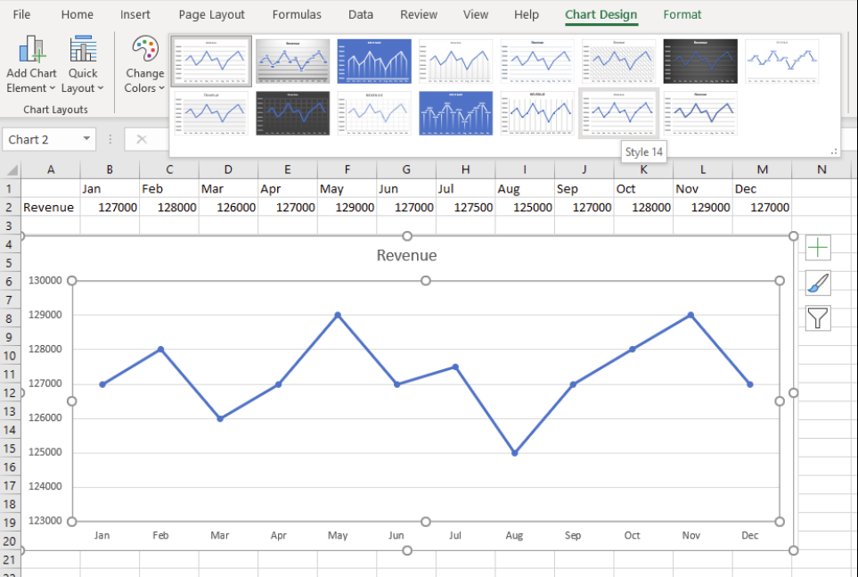
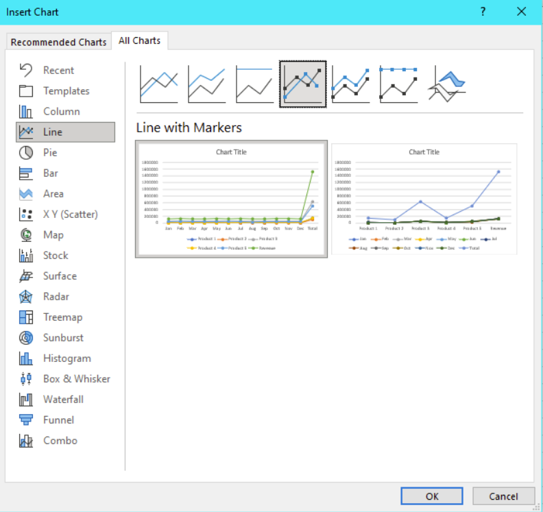

# 📊 Lab 14.1.16: Build Visuals to Make an Impact

[← กลับหน้าหลัก](README.md)

> **หลักสูตร:** Data+ (Exam DA0-002) · **Module:** 14 — Data Visualization  
> **คะแนน:** ✅ 7/7 (100%)

---

## 🔗 ทำไม Lab นี้ถึงสำคัญกับโปรเจกต์อุบัติเหตุ?

ตัวเลข "38,254 ราย" ไม่ทำให้ใครรู้สึกอะไร  
แต่กราฟที่แสดงให้เห็นว่ารถจักรยานยนต์คือ **79%** ของแถบสีแดงขนาดยักษ์ —  
นั่นแหละที่ทำให้คนหยุด อ่าน และเปลี่ยนพฤติกรรม

Lab นี้สอนให้เปลี่ยนตัวเลขให้กลายเป็น Insight ที่จับต้องได้

---

## 📌 ภาพรวม Lab

Lab นี้มุ่งเน้นการเปลี่ยน **ข้อมูลดิบ** ให้กลายเป็น **Visualization ที่สื่อสารได้ทันที** โดยทำงานกับข้อมูลด้านการศึกษาและรายได้ สำรวจหลักการเลือกประเภทกราฟที่เหมาะสม และเทคนิคการออกแบบที่ทำให้ภาพมีพลังในการสื่อสาร Insight

*หน้าจอ Lab 14.1.16 แสดงข้อมูลด้านการศึกษาและรายได้ที่ใช้ใน Lab*

---

## 🎯 ทำไม Visualization ถึงสำคัญ?

> **"A picture is worth a thousand words"**  
> Visual ที่ดีคือ Visual ที่ผู้ดูเข้าใจ Insight หลักได้ภายใน **5 วินาที**

ตัวอย่างเช่น ถ้าบอกว่า *"รายได้เดือน May และ November มียอด 129,000"* ใน 1 ประโยค กับการ **ดูกราฟ** ที่เห็น spike ทั้ง 2 เดือนทันที — อะไรเข้าใจเร็วกว่ากัน?

---

## 📈 ประเภทกราฟที่ศึกษาใน Lab

### 🥧 1. Pie Chart — แสดงสัดส่วน

**ใช้เมื่อ:** ต้องการแสดงสัดส่วนของแต่ละหมวดหมู่เทียบกับภาพรวมทั้งหมด

| ข้อค้นพบ | รายละเอียด |
|---|---|
| หมวดหมู่ใหญ่ที่สุด | **Bachelor degree** |
| ประเภทข้อมูล | Count of individuals with different education levels |

> ⚠️ **ข้อควรระวัง:** Pie Chart ใช้ได้ดีเมื่อมีไม่เกิน 5–6 หมวดหมู่

---

### 📊 2. Bar Chart — เปรียบเทียบหมวดหมู่

**ใช้เมื่อ:** ต้องการเปรียบเทียบข้อมูลระหว่างหมวดหมู่ได้อย่างชัดเจน

| ประเภท | ลักษณะ |
|---|---|
| **Simple Bar** | แท่งเดี่ยวต่อหมวดหมู่ |
| **Clustered Bar** | แท่งคู่ มี **2 options** สำหรับเปรียบเทียบ 2 ชุดข้อมูลพร้อมกัน |

---

### 📉 3. Line Chart — แสดงแนวโน้มตามเวลา

**ใช้เมื่อ:** ต้องการแสดงแนวโน้มและการเปลี่ยนแปลงตามช่วงเวลา

| ประเภท | ลักษณะ | ใช้เมื่อ |
|---|---|---|
| **Single Line** | 1 เส้น | ติดตามข้อมูลชุดเดียว |
| **Multiple Line** | หลายเส้น | เปรียบเทียบข้อมูลหลายชุดพร้อมกัน |

**ข้อค้นพบสำคัญ:** เดือน **May และ November** มียอดรายได้ **129,000** — เห็นได้ชัดจาก spike บน Line Chart

---

## 🔍 สรุปสิ่งที่ค้นพบ

| คำถาม | คำตอบ |
|---|---|
| หมวดหมู่ใหญ่ที่สุดใน Pie Chart คืออะไร? | **Bachelor degree** |
| Clustered Bar มีกี่ options? | **2 options** |
| เดือนใดมียอดรายได้ 129,000? | **May และ November** |
| Chart ประเภทใดแสดงสัดส่วน? | **Pie Chart** |
| Chart ประเภทใดแสดงแนวโน้มตามเวลา? | **Line Chart** |

---

## 💡 หลักการเลือกกราฟให้ถูกต้อง

| ต้องการแสดงอะไร | กราฟที่เหมาะสม | เหตุผล |
|---|---|---|
| **สัดส่วน** เทียบกับทั้งหมด | 🥧 Pie / Donut Chart | เห็นสัดส่วนร้อยละทันที |
| **เปรียบเทียบ** ระหว่างหมวดหมู่ | 📊 Bar Chart | เปรียบขนาดได้ง่ายกว่า Pie |
| **แนวโน้ม** ตามเวลา | 📉 Line Chart | เชื่อมจุดให้เห็นทิศทาง |
| **การกระจาย** ของข้อมูล | 🔵 Scatter Plot | เห็น outliers และ pattern |
| **หลายตัวแปร** ตามเวลา | 📈 Multiple Line | เปรียบเทียบแนวโน้มหลายเส้น |

---

## 🎨 สิ่งที่ทำให้ Visual มี Impact

### ✂️ 1. Clarity — ตัดสิ่งที่ไม่จำเป็นออก
ลด noise ให้เหลือเฉพาะสิ่งที่สำคัญ

### 🔦 2. Highlight — เน้นจุดสำคัญ
ใช้สี ขนาด หรือ annotation เพื่อดึงสายตาไปยัง insight หลัก

### 🎨 3. Color with Meaning — สีที่มีความหมาย
ใช้สีอย่างมีเหตุผล ไม่ตกแต่งเพื่อความสวยงามล้วน ๆ

### 📐 4. Right Chart Type — เลือกกราฟให้ตรง
เลือกให้ตรงกับลักษณะข้อมูลและสิ่งที่อยากสื่อสาร

---

## 📝 สรุปบทเรียน

> Data Visualization ที่ดี **ไม่ใช่แค่กราฟที่สวย**  
> แต่คือกราฟที่ช่วยให้ผู้ดู **ตัดสินใจได้เร็วขึ้น** และ **เข้าใจข้อมูลได้ลึกขึ้น**

**Key Takeaways:**
- 🔑 เลือก Chart Type ให้ตรงกับ **ลักษณะข้อมูลและเป้าหมาย**
- 🔑 Pie → สัดส่วน, Bar → เปรียบเทียบ, Line → แนวโน้ม
- 🔑 Visual ที่ดีต้องสื่อสาร **Insight หลักได้ภายใน 5 วินาที**
- 🔑 ใช้สีอย่างมีความหมาย ไม่ตกแต่งเกินความจำเป็น

---

[← กลับหน้าหลัก](README.md) · [← ดู Lab 9.1.12](Implement-Queries-and-Join-Types.md)
