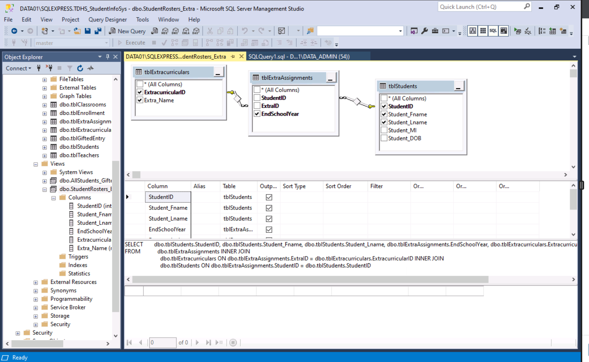
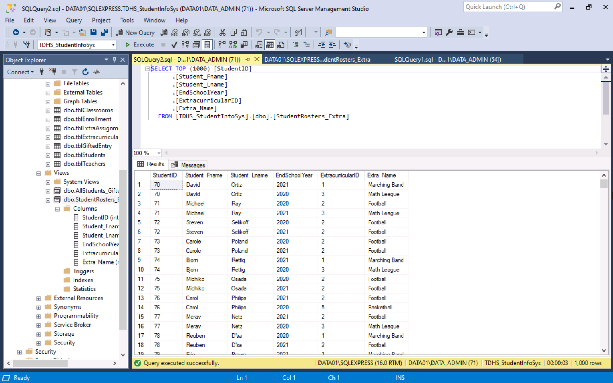
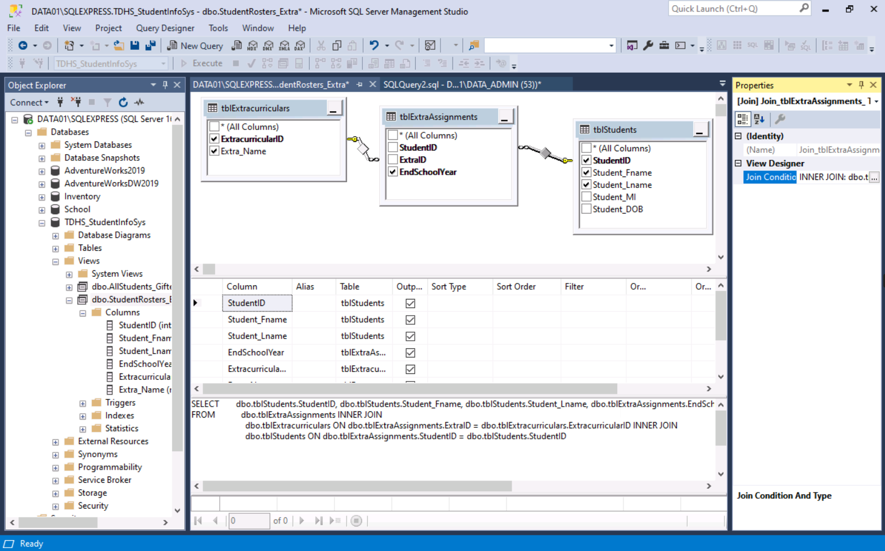
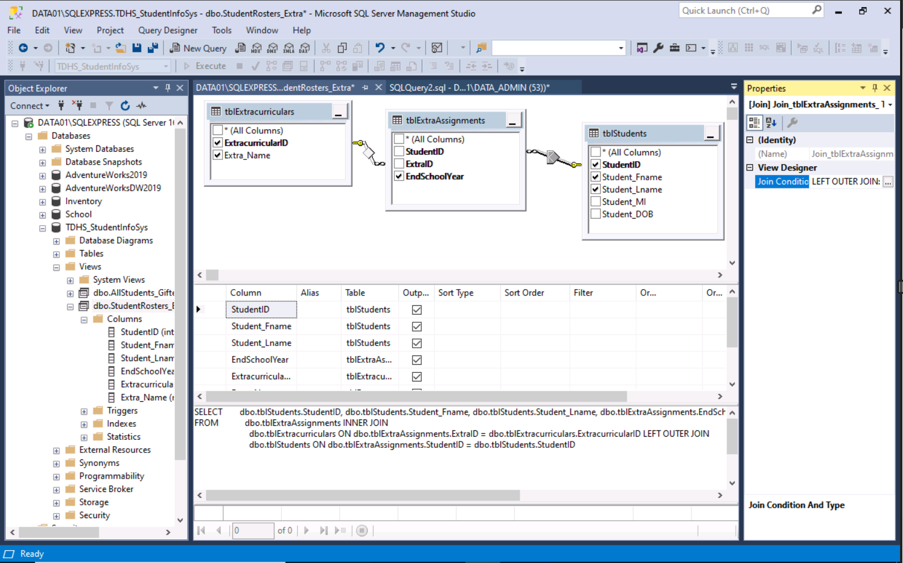
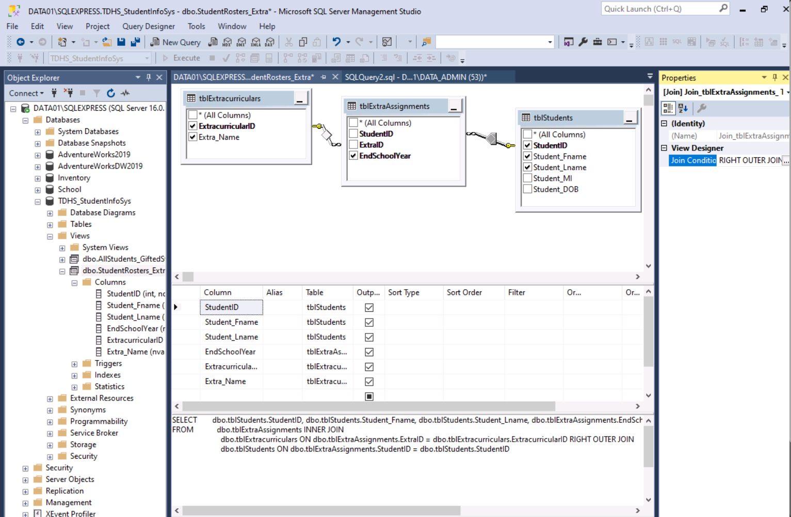
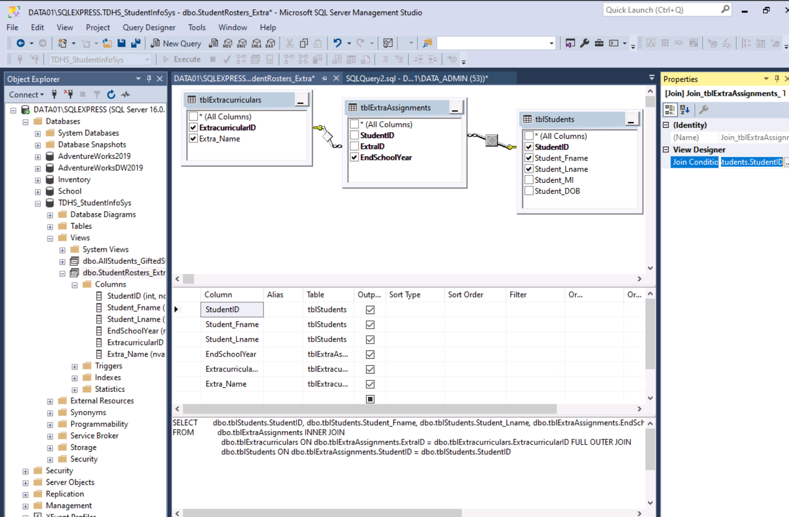
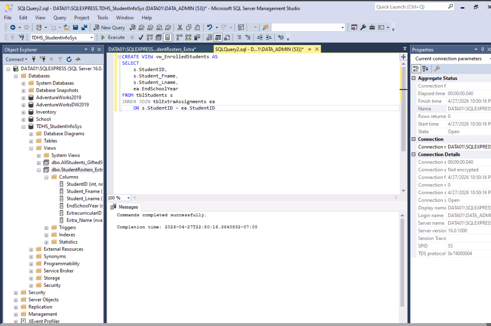
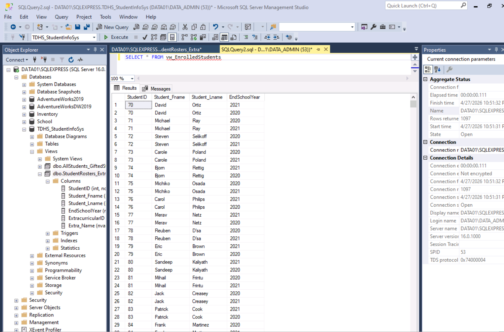

# 🗄️ Lab 9.1.12: Implement Queries and Join Types

[← กลับหน้าหลัก](README.md)

> **หลักสูตร:** Data+ (Exam DA0-002) · **Module:** 9 — Database Queries  
> **คะแนน:** ✅ 9/9 (100%)

---

## 🔗 ทำไม Lab นี้ถึงสำคัญกับโปรเจกต์อุบัติเหตุ?

ข้อมูลอุบัติเหตุที่ใช้วิเคราะห์มาจาก **3 ฐานข้อมูลที่ต่างกัน** — ถ้าไม่รู้จัก JOIN  
ก็ไม่มีทางดึงข้อมูลออกมาวิเคราะห์ได้เลย

Lab นี้คือพื้นฐานที่ทำให้โปรเจกต์ทั้งหมดเกิดขึ้นได้

---

## 📌 ภาพรวม Lab

Lab นี้ใช้ข้อมูลของ **นักเรียน** ประกอบด้วยตาราง `Students`, `Enrollment` และกิจกรรมนอกหลักสูตร โดยฝึกเขียน SQL Query เพื่อดึงข้อมูลจากหลายตารางพร้อมกัน ผ่านการใช้ **JOIN 4 ประเภท** บนโปรแกรม **SSMS** (SQL Server Management Studio)


*หน้าต่าง SSMS แสดง Object Explorer และตาราง Students, Enrollment*

---

## 🗂️ โครงสร้างข้อมูลที่ใช้

| ตาราง | เก็บข้อมูลอะไร | Primary Key |
|---|---|---|
| `Students` | ข้อมูลนักเรียน เช่น ชื่อ อายุ | `StudentID` |
| `Enrollment` | ข้อมูลการลงทะเบียนวิชา | `EnrollmentID` |
| `Extracurriculars` | กิจกรรมนอกหลักสูตร | `ActivityID` |


*โครงสร้างตาราง Students และ Enrollment แสดง columns และ data types*

---

## 🔗 JOIN คืออะไร และทำไมต้องใช้?

ในโลกของฐานข้อมูลจริง ข้อมูลไม่ได้อยู่ในตารางเดียว — เราต้องใช้ JOIN เพื่อ **เชื่อมสองตารางเข้าด้วยกัน** ผ่าน key ที่ตรงกัน

```
Students Table          Enrollment Table
┌────────────┐          ┌────────────────┐
│ StudentID  │──────────│ StudentID (FK) │
│ Name       │          │ EnrollmentDate │
│ Age        │          │ SubjectID      │
└────────────┘          └────────────────┘
         ↑ JOIN เชื่อมผ่าน StudentID ↑
```

---

## 📊 JOIN 4 ประเภทที่ใช้ใน Lab

### 1. 🟢 INNER JOIN — เฉพาะข้อมูลที่ match กัน

คืน **เฉพาะแถวที่มีคู่ตรงกัน** ในทั้งสองตาราง

```sql
SELECT * FROM Students
INNER JOIN Enrollment 
    ON Students.StudentID = Enrollment.StudentID
```

> 💡 **เหมาะกับ:** เมื่อต้องการเฉพาะข้อมูลที่ครบสมบูรณ์ทั้งคู่



---

### 2. 🔵 LEFT OUTER JOIN — ทุกแถวจากตารางซ้าย

คืน **ทุกแถวจากตารางซ้าย (Students)** แม้ตารางขวาจะไม่มีคู่

```sql
SELECT * FROM Students
LEFT OUTER JOIN Enrollment 
    ON Students.StudentID = Enrollment.StudentID
```



---

### 3. 🟠 RIGHT OUTER JOIN — ทุกแถวจากตารางขวา (60 แถว)

คืน **ทุกแถวจากตารางขวา (Enrollment)** — ใน Lab นี้ได้ผลลัพธ์ **60 แถว**

```sql
SELECT * FROM Students
RIGHT OUTER JOIN Enrollment 
    ON Students.StudentID = Enrollment.StudentID
```



---

### 4. 🟣 FULL OUTER JOIN — ทุกแถวจากทั้ง 2 ตาราง (561 แถว)

รวม **ทุกแถวจากทั้งสองตาราง** — ได้ผลลัพธ์ **561 แถว**

```sql
SELECT * FROM Students
FULL OUTER JOIN Enrollment 
    ON Students.StudentID = Enrollment.StudentID
```


*ผลลัพธ์ FULL OUTER JOIN — 561 แถว รวมทั้งแถวที่ไม่มีคู่ซึ่งมีค่า NULL*

---

## 📊 เปรียบเทียบ JOIN ทั้ง 4 แบบ

| JOIN Type | จำนวนแถวที่ได้ | ข้อมูลที่ได้ |
|---|---|---|
| INNER JOIN | น้อยที่สุด | เฉพาะแถวที่ match ทั้งคู่ |
| LEFT OUTER JOIN | ปานกลาง | ทุกแถวจาก Students + match จาก Enrollment |
| RIGHT OUTER JOIN | **60 แถว** | ทุกแถวจาก Enrollment + match จาก Students |
| FULL OUTER JOIN | **561 แถว** | ทุกแถวจากทั้ง 2 ตาราง |

---

## 🔍 สิ่งที่ค้นพบจากข้อมูล

| คำถาม | คำตอบ |
|---|---|
| RIGHT OUTER JOIN คืนกี่แถว? | **60 แถว** |
| FULL OUTER JOIN คืนกี่แถว? | **561 แถว** |
| มี NULL ใน `Student_ID` ไหม? | **ไม่มี** — Primary Key ครบทุกแถว |
| Inner และ Outer JOIN ให้ผลเหมือนกันไหม? | **ไม่** — ต่างกันเสมอเมื่อข้อมูลไม่ match ทั้งหมด |

---

## 👁️ Views: บันทึก Query ที่ใช้บ่อย

```sql
-- สร้าง VIEW สำหรับข้อมูลนักเรียนที่ลงทะเบียนแล้ว
CREATE VIEW vw_EnrolledStudents AS
SELECT Students.StudentID, Students.Name, Enrollment.EnrollmentDate
FROM Students
INNER JOIN Enrollment ON Students.StudentID = Enrollment.StudentID

-- เรียกใช้ VIEW
SELECT * FROM vw_EnrolledStudents
```




---

## 📝 สรุปบทเรียน

> JOIN ที่ถูกต้องส่งผลโดยตรงต่อ **ความครบถ้วนของข้อมูล**  
> FULL OUTER JOIN (561 แถว) ให้ข้อมูลมากกว่า RIGHT OUTER JOIN (60 แถว)  
> เพราะรวมข้อมูลจากทั้งสองตาราง รวมถึงส่วนที่ไม่มีคู่ตรงกันด้วย

**Key Takeaways:**
- 🔑 JOIN เชื่อมตารางผ่าน **Foreign Key** ที่มีค่าตรงกัน
- 🔑 เลือก JOIN type ให้ตรงกับว่าต้องการ "ทุกแถว" จากฝั่งไหน
- 🔑 NULL ใน result = ข้อมูลไม่มีคู่ในอีกตาราง ไม่ใช่ error
- 🔑 VIEW ช่วยประหยัดเวลาเมื่อต้องใช้ Query ซ้ำบ่อย ๆ

---

[← กลับหน้าหลัก](README.md) · [→ ดู Lab 14.1.16](Build-Visuals-to-Make-an-Impact.md)
