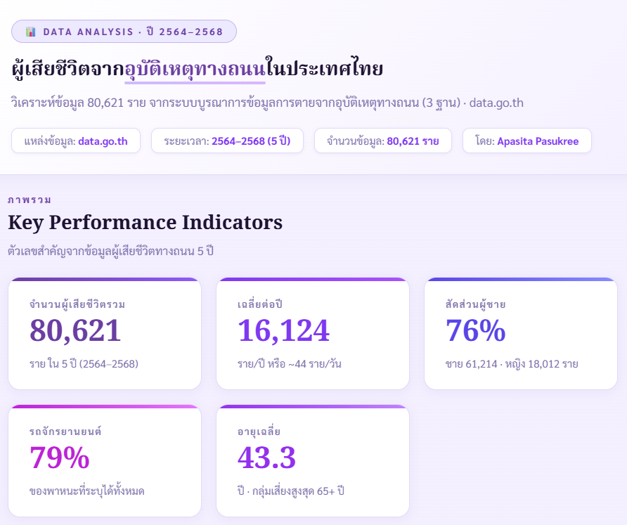

# 📊 ผลวิเคราะห์ — ผู้เสียชีวิตจากอุบัติเหตุทางถนน (2564–2568)

[← กลับหน้าหลัก](README.md)

> **คำถามตั้งต้น:** ถ้าจะมีรถส่วนตัว ควรใช้รถแบบไหนถึงปลอดภัย?  
> **วิธีตอบ:** วิเคราะห์ข้อมูลผู้เสียชีวิตจากอุบัติเหตุจริง 80,621 รายด้วย AI 3 โมเดล

---

## 🗂️ ข้อมูลที่ใช้

| รายละเอียด | ข้อมูล |
|---|---|
| **แหล่งข้อมูล** | [data.go.th](https://data.go.th) — ระบบบูรณาการข้อมูลการตาย |
| **ช่วงเวลา** | ปี 2564–2568 (5 ปี) |
| **จำนวนข้อมูล** | 80,621 ราย |
| **เครื่องมือ** | Python · Claude AI · ChatGPT · Gemini |

---

## 📈 Interactive Dashboard

> 💡 **เปิดแบบเต็มหน้าจอ** → [คลิกที่นี่](dashboard/dashboard.html)

---

## 🔑 Insights สำคัญ 5 ข้อ

### 🔴 1. มกราคม — เดือนอันตรายที่สุด (1,634 ราย)

ช่วงเทศกาลปีใหม่ทำให้ผู้เสียชีวิตพุ่งสูงสุดของทุกปี  
สาเหตุหลัก: การเดินทางไกล + ดื่มแอลกอฮอล์ + ขับรถกลางดึก

---

### 🔵 2. ผู้ชายเสียชีวิต 3 เท่าของผู้หญิง (76% ชาย)

สะท้อนพฤติกรรมการขับขี่ที่แตกต่างกัน — ผู้ชายขับเร็ว ใช้รถจักรยานยนต์ และขับกลางคืนมากกว่า

---

### 🟡 3. รถจักรยานยนต์ = ภัยอันดับ 1 (38,254 ราย = 79%)

**นี่คือคำตอบของคำถามเรื่องรถ**

| พาหนะ | จำนวนผู้เสียชีวิต | สัดส่วน |
|---|---|---|
| 🏍️ รถจักรยานยนต์ | 38,254 | 79% |
| 🚗 รถยนต์ | 4,322 | ~9% |
| 🚶 คนเดินเท้า | 1,682 | ~3% |

---

### 🟢 4. ผู้สูงอายุ 65+ เสียชีวิตมากที่สุด (12,280 ราย)

ไม่ใช่เพราะขับเร็ว แต่เพราะขาดทางเลือกในการเดินทางและฟื้นตัวยากกว่า

---

### 🟣 5. 19:00 น. คือชั่วโมงมรณะ

แสงสว่างลดลงกะทันหัน + ความเหนื่อยล้าสะสม = 750 รายต่อชั่วโมง สูงสุดในรอบวัน

---

## 💡 สรุป — คำตอบของคำถามตั้งต้น

> ถ้าถามว่า **"ควรใช้รถแบบไหนถึงปลอดภัย?"**  
> ข้อมูล 5 ปี 80,621 ราย ตอบชัด: **รถยนต์ปลอดภัยกว่ารถจักรยานยนต์อย่างมีนัยสำคัญ**
>
> และถ้าต้องใช้รถจักรยานยนต์ — ระวังช่วง 19:00 น. และเดือนมกราคมเป็นพิเศษ

---

[← กลับหน้าหลัก](README.md)
