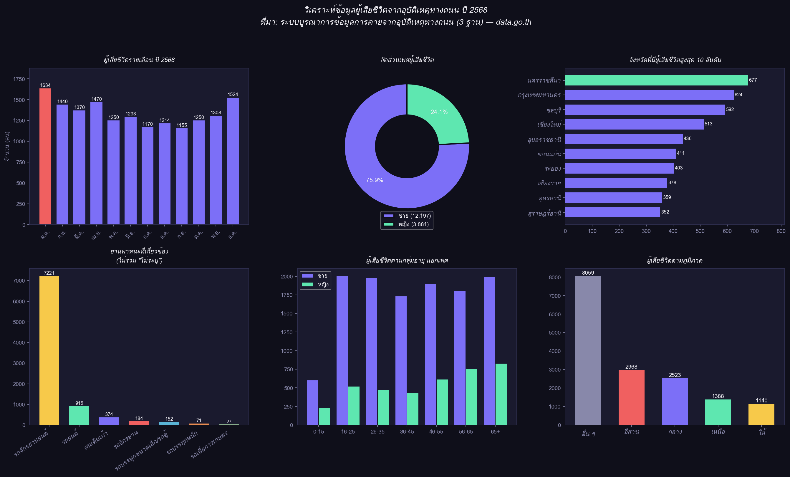

# 📊 Dataset Analysis: ผู้เสียชีวิตจากอุบัติเหตุทางถนน ปี 2568

[← กลับหน้าหลัก](README.md)

---

## 🗂️ ที่มาของข้อมูล

| รายละเอียด | ข้อมูล |
|---|---|
| **ชุดข้อมูล** | ผู้เสียชีวิตจากอุบัติเหตุทางถนน ปี 2568 |
| **แหล่งข้อมูล** | [data.go.th](https://data.go.th) — Open Government Data ประเทศไทย |
| **ระบบ** | ระบบบูรณาการข้อมูลการตายจากอุบัติเหตุทางถนน (3 ฐาน) |
| **จำนวนแถว** | 16,078 ราย |
| **ช่วงเวลา** | 1 มกราคม — 31 ธันวาคม 2568 |

---

## 🔬 เครื่องมือที่ใช้วิเคราะห์ (3 เครื่องมือ)

### 1. 🐍 Python (Pandas + Matplotlib)
วิเคราะห์เชิงสถิติจากข้อมูลดิบโดยตรง นับจำนวน จัดกลุ่ม และสร้าง Visualization ที่แม่นยำที่สุด เพราะประมวลผลทุก record ทั้ง 16,078 ราย

### 2. 🤖 Claude AI
ตีความ pattern ที่ซ่อนอยู่ในข้อมูล อธิบาย insight เชิงบริบทสังคม และเชื่อมโยงกับปัจจัยที่ตัวเลขอาจไม่ได้บอกโดยตรง

### 3. 💬 ChatGPT
เปรียบเทียบการตีความ ตั้งคำถามเชิงสาธารณสุข และเสนอแนวทางนำข้อมูลไปใช้เชิงนโยบาย

---

## 📈 Dashboard ภาพรวม

---

## 💡 Insight ที่ค้นพบ

### 🔴 Insight 1: มกราคมอันตรายที่สุด

เดือน **มกราคม มีผู้เสียชีวิตสูงสุด 1,634 ราย** รองลงมาคือธันวาคม (1,524 ราย)
สอดคล้องกับช่วง **"เจ็ดวันอันตราย"** ปีใหม่ที่มีการเดินทาง ดื่มแล้วขับ และขับเร็วมากขึ้น
กันยายนมีผู้เสียชีวิตน้อยสุด (1,155 ราย) ซึ่งเป็นช่วงไม่มีเทศกาลใหญ่

> ควรเร่งมาตรการเชิงรุก **ก่อน**เทศกาล ไม่ใช่แค่ **ระหว่าง**เทศกาล

---

### 🔵 Insight 2: ผู้ชายเสียชีวิต 3 เท่าของผู้หญิง

| เพศ | จำนวน | สัดส่วน |
|---|---|---|
| ชาย | 12,197 | 75.8% |
| หญิง | 3,881 | 24.2% |

สะท้อนพฤติกรรมการขับขี่เสี่ยงที่พบในผู้ชายสูงกว่า ทั้งไม่สวมหมวกกันน็อค ขับเร็ว และดื่มแล้วขับ

---

### 🟡 Insight 3: รถจักรยานยนต์ = ภัยอันดับ 1

ในกลุ่มที่ระบุยานพาหนะได้:

| ยานพาหนะ | จำนวน |
|---|---|
| **รถจักรยานยนต์** | **7,221** |
| รถยนต์ | 916 |
| คนเดินเท้า | 374 |
| รถจักรยาน | 184 |

รถจักรยานยนต์คิดเป็น **~79%** ของยานพาหนะที่ระบุได้ทั้งหมด แม้จะมีจำนวนบนถนนน้อยกว่ารถยนต์

---

### 🟢 Insight 4: ผู้สูงอายุ 65+ เสียชีวิตมากที่สุดในทุกกลุ่ม

| กลุ่มอายุ | จำนวน |
|---|---|
| 0–15 ปี | 826 |
| 16–25 ปี | 2,519 |
| 26–35 ปี | 2,437 |
| 36–45 ปี | 2,157 |
| 46–55 ปี | 2,506 |
| 56–65 ปี | 2,552 |
| **65+ ปี** | **2,812** |

สะท้อนทั้งร่างกายที่ฟื้นตัวช้า และผู้สูงอายุในชนบทที่ยังต้องพึ่งรถจักรยานยนต์

---

### 🟣 Insight 5: นครราชสีมา — จังหวัดอันดับ 1

| อันดับ | จังหวัด | ผู้เสียชีวิต |
|---|---|---|
| 1 | นครราชสีมา | 677 |
| 2 | กรุงเทพมหานคร | 624 |
| 3 | ชลบุรี | 592 |
| 4 | เชียงใหม่ | 513 |
| 5 | อุบลราชธานี | 436 |

จังหวัดที่ประชากรหนาแน่น ทางผ่าน หรือมีการเดินทางระหว่างจังหวัดสูง ล้วนติด Top 10

---

## 🔄 เปรียบเทียบผลจาก 3 เครื่องมือ

| ประเด็น | Python | Claude AI | ChatGPT |
|---|---|---|---|
| ตัวเลขแม่นยำ | ✅ แม่นยำสูงสุด | อ้างอิงจาก Python | ใกล้เคียง |
| ตีความ pattern | ให้ตัวเลขเท่านั้น | ✅ เชื่อมบริบทสังคม | ✅ มุมมองนโยบาย |
| สร้าง Visualization | ✅ กราฟละเอียด | ❌ | ❌ |
| ข้อเสนอแนะ | ❌ | ✅ เชิงพฤติกรรม | ✅ เชิงสาธารณสุข |

**สรุป:** Python ให้ความแม่นยำ, AI ช่วยตีความ, ใช้ร่วมกันให้ผลดีที่สุด

---

## 📝 ข้อเสนอแนะเชิงนโยบาย

1. **เร่งมาตรการก่อนเทศกาล** โดยเฉพาะปีใหม่และสงกรานต์
2. **มุ่งเป้าที่รถจักรยานยนต์** บังคับใช้กฎหมายหมวกกันน็อค และพัฒนาโครงสร้างพื้นฐาน
3. **ดูแลผู้สูงอายุเป็นพิเศษ** ทั้งการตรวจสมรรถภาพและทางเลือกในการเดินทาง

---

*ที่มา: ระบบบูรณาการข้อมูลการตายจากอุบัติเหตุทางถนน (3 ฐาน) · data.go.th · ปี 2568*

[← กลับหน้าหลัก](README.md)
